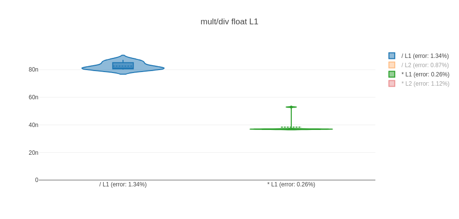

# Nanobench toolbox

We provide in this repository complementary tools for [nanobench](https://nanobench.ankerl.com/)
micro-benchmarks.

## Installation

This toolbox is header only. You just need to drop the `*.hpp` files somewhere seen by your
compilation chain. You can:

- register the `include/` directory through `include_directories()` with CMake, or in your `$CPATH`
  directory list,
- or add it explicitly in the `$CXXFLAGS`/compilation line with `-I/path/to/the/include`.

Note: it depends on:

- [nanobench](https://nanobench.ankerl.com/) explicitly,
- [plotly](https://plotly.com/javascript/) indirectly,
- and on [doctest](https://github.com/doctest/doctest) optionally.

## Features and Usage

### Violin plots

`nanobench_html_graph_renderer.hpp` defines `HtmlGraphRenderer` class.

This class helps produces an HTML file that draws
[box plots](https://plotly.com/javascript/box-plots/) or
[violin plots](https://plotly.com/javascript/violin/) thanks to plotly JavaScript API.

It's very similar to what `ankerl::nanobench::templates::htmlBoxplot()` returns.

The differences are:

- Several benchmarks can add plots to the same HTML file.
- We can choose to display plot legends on the side. This permits to interactively select which plot
  we want to display.
- On top of _box plots_, _violin plots_ are also supported. Even when generating violin plots, the
  associated box plot, median, and mean will also be displayed to help visually detect quartiles,
  median…
- Spacing between plots have been reduced.
- The name of each plot will also include the
  [Median Absolute Percentage Error](https://en.wikipedia.org/wiki/Mean_absolute_percentage_error)
  which is automatically computed by nanobench.
- Plotly version has been updated to the latest at the time (April 2025).

In order to reuse the same output HTML file for multiple benchmarks, you'll need a shared
`HtmlGraphRenderer` instance between all benchmarks. In case you're using the doctest based approach
described in nanobench documentation, check the next section.

See for instance [test/example_violin.html](src/test/example_violin.html) as an example of what
could be produced from a simple [benchmark](src/test/example_violin.cpp).

### New `main()` helper for doctest

In order to simplify the usage of `HtmlGraphRenderer` from Doctest tests, an alternative and
specialized version of `main()` is provided in `nanobench_html_graph_doctest_main.hpp`.

Doctest executables will now have a `--renderto=<file.html>` option that enables
[plot generation](#violin-plots) into the chosen filename.

From the test case, just call `render_graph(thebenchmark, "benchmark title")`. For instance:

```c++
// As with doctest and nanobench, this macro needs to be set before
// the #include  "nanobench_html_graph_doctest_main.hpp" if you want
// to tune rendering options.
#define NANOBENCH_VIOLIN_OPTIONS \
    .showepochs(true) \
    .rangemode("")

#include "nanobench_html_graph_doctest_main.hpp"

TEST_CASE("mult/div float L1") {
    ankerl::nanobench::Bench b;
    b.title("mult/div float L1")
        ... ;
    b.performanceCounters(true);
    b.run(....);
    b.run(....);
    render_graph(b, "mult/div float L1");
}
```

Configuration options are available through the `NANOBENCH_VIOLIN_OPTIONS` macro.

### Range iterable random sequence

`rng.hpp` defines `RNG` class which can be seen as a simplified (and specialized) version of
[`std::ranges::generate_random`](https://en.cppreference.com/w/cpp/algorithm/ranges/generate_random).

- `RNG<T>(N)` builds an iterable range of N random numbers of type `T`, uniformly distributed,
  between the min and max values for type `T`
- `RNG<T>(first, last, N)` builds an iterable range of N random numbers of type `T`, uniformly
  distributed, between `first` and `last` values.

## Examples

Examples are available in `src/test/`. At the moment, we only provide a GNU-`M̀akefile` for Linux
systems.



## Licence

This toolbox is licensed under the MIT License. See the LICENSE file for details.

## To-do

The state of the toolbox is halfway between a gist/snippet and a real project.
Many improvements are possible.

- Contribute a way to correctly inject new options and expand
  [doctest](https://github.com/doctest/doctest) context object.

- Find a proper namespace name to put everything in it.
- Write a separate and more complete doc.
- Define CMake and/or meson configuration files.
- Provide `pkg-config` / LMod `module` configuration files?

- Support other plot types.
- Support more options for each plot type.
- Support options to improve the layout of the `<div/>` produced.
